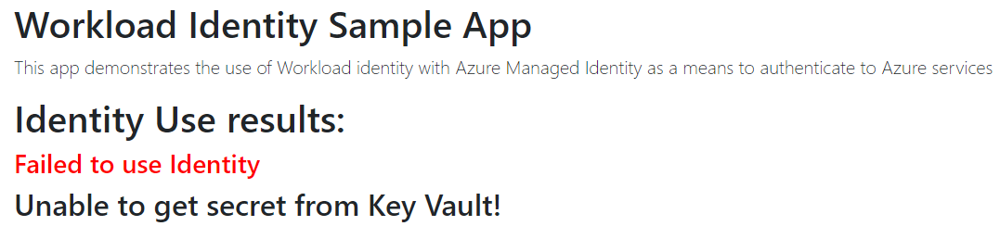

# AKS Workload Identity with Managed Identity Sample

This repository will demonstrate the creation of an AKS cluster that uses Workload Identity associcated with an Azure AD Managed Identity. 

The container code will show how a pod deployed and linked with the appropriately configured Kubernetes service account can then easily leverage the SDK [Azure.Identity](https://docs.microsoft.com/en-us/dotnet/api/overview/azure/identity-readme) to use the Managed Identity to connect to other Azure services. In this case, pulling a [secret from Azure Key Vault](https://docs.microsoft.com/en-us/dotnet/api/overview/azure/security.keyvault.secrets-readme). This sample uses Windows containers but the same can easily be accomplished with Linux containers.


## Get Started

To set up your environment, use the `deploy.ps1` PowerShell script to create your Azure resources. The script will create:

- Azure Kubernetes Service with a Linux system nodes and Windows user nodes. The cluster will also have OIDC issuer and Workload Identity features enabled.
- Azure Key Vault with a sample secret
- Azure Container Registry (optional)
- User Assigned Managed Identity
- Virtual Network and Network Security Group

The script will also run several `kubectl` commands to confure the Kubernetes environment:

- Create a Kubernetes Service Account associated with the User Assigned Managed Identity
- Federate the User Assigned identity with the Kubernetes OIDC provider
- Deploy a pod `samplewithidentity` that will show a properly assigned Service Account & Workload Identity retrieve the secret from Key Vault
- Deploy a pod `samplenoidentity`  that will show how a pod not associated with Service Account can not connect to Key Vault

**Run script**

``` PowerShell
az login
deploy.ps1 -prefix "<6 char prefix for service name>" -resourceGroupName "<group name>" -includeContainerRegistry "<$true|$false>"
```

## Running Sample Pods

After running the deployment script, you should have two pods running `samplewithidentity` and `samplenoidentity`. You can see these in action and demonstrate their Key Vault access by connecting to the pods and loading the index page:

### Pod with associated workload identity

1. Run `kubectl port-forward pod/samplewithidentity 8080:80` 
2. Open your browser to [http://localhost:8080](http://localhost:8080). 
3. You should see a success message:


### Pod in same cluster and namespace without workload identity

1. Run `kubectl port-forward pod/samplenoidentity 8081:80` 
2. Open your browser to [http://localhost:8081](http://localhost:8081). 
3. You should see a success message:


## How it works

